<p align="right">

</p>

<h2 align="center">


  


<!-- old comment out


<p align="center"> <a href="https://git.io/typing-svg"></a>
<p align="left">  </p>
</p> 
 </br>--> 


<h2 align="center">🚀 About Me</h2>
<p align="center">


</p>

<p align="center">
</p>


```bash
aabidnabi@terminal:~$ 

Name: Aabid Nabi
Role: Software Developer | Scalable Systems & AI

Focus:
  - Production-grade system design
  - Clean architecture and maintainability
  - Performance optimization and scalability
  - Secure system development

Interests:
  - Applied Machine Learning
  - Full Stack Engineering
  - Distributed Systems
  - Cybersecurity

Current_work:
  - Building scalable end-to-end systems
  - Integrating ML into production pipelines
  - Exploring LLMs, LangChain, and cloud-native architectures

Quote:
  "Performance is engineered. Security is enforced. Scalability is designed."
```

<div align="center">



</div>

---

<div align="center">

### 🌐 Connect with me

[](https://linkedin.com/in/aabidnabi)
[](https://twitter.com/aabidnabi)
[](https://aabidnabi.dev)
[](mailto:aabid@example.com)

</div>

---

## ⚡ Tech Stack

<div align="center">

### Languages


### Frameworks & Libraries


### Databases & Infra


### AI / ML


</div>

---

## 📊 GitHub Stats

<div align="center">


</div>

<div align="center">

[](https://git.io/streak-stats)

</div>

---

## 🚀 Current Projects

| Project | Description | Stack |
|---------|-------------|-------|
| **ScaleAPI** | High-throughput REST gateway with auto-scaling | Go · Redis · Kubernetes |
| **MLPipeline** | Production ML inference pipeline with monitoring | Python · FastAPI · PyTorch |
| **SecureVault** | Zero-trust secrets management service | Rust · PostgreSQL · Docker |

---

<div align="center">

```
╔══════════════════════════════════════════════════════════════╗
║  "Performance is engineered.                                ║
║   Security is enforced.                                     ║
║   Scalability is designed."                                 ║
╚══════════════════════════════════════════════════════════════╝
```


</div>

<h3 align="center">
  <p color="red">Tech Stack: </p>
</h3>

<p align="center">

</p>

---
<h2 align="center">⚡ Stats ⚡</h2>
<br>
<div align=center>
  
  
  <br/>
  
</div>

---
<h3 align="center">Social Links: </h3>
<p align="center">
 <a href="https://linkedin.com/in/aabid-nabi-031267184" target="_blank" rel="noopener noreferrer">
    
  </a>
 <a href="https://aabidnabi.tech/"  target="_blank" rel="noopener noreferrer">
    
  </a>
  <a href="mailto:tantryinfo98@gmail.com" >
    
  </a>
  <a href="https://leetcode.com/aabidtantry"  target="_blank" rel="noopener noreferrer">
    
  </a>
 <a href="https://youtube.com/@cscodehubtutorials9923?si=ppgQJs8pgRaCPJz3" target="_blank" rel="noopener noreferrer">
    
  </a>
  <a href="https://x.com/aabid__nabi"  target="_blank" rel="noopener noreferrer">
    
  </a>
  <a href="https://fb.com/aabid-nabi"  target="_blank">
    
  </a>
  <a href="https://instagram.com/aabid__nabi_"  target="_blank" rel="noopener noreferrer">
    
  </a>
</p>

----
<div align="center">
<h1 align="center">
    
</h1>
</div>


